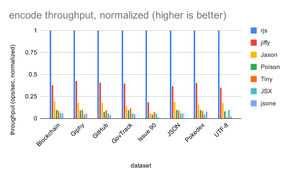
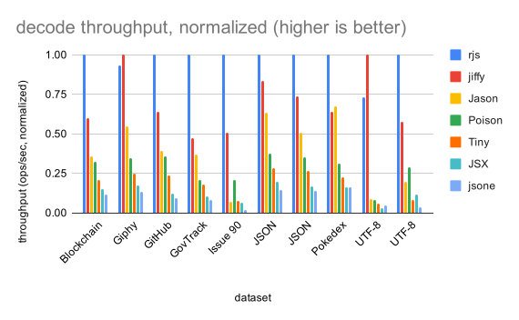

# rjs

## install

On `rebar.config`, add

```erlang
{deps, [
    {rjs, {git, "https://github.com/yjh0502/rjs", {branch, "master"}}}
]}.
```

## usage

### `decode/1,2`

```erlang
decode(JSON) -> Result
decode(JSON, Opts) -> Result

  JSON = binary() | iolist()
  Result = {ok, term()}
  Opts = [binary | atom | existing_atom | attempt_atom]
```

See [jsx:decode/1,2](https://github.com/talentdeficit/jsx/blob/develop/README.md#decode12)

### `encode/1`

```erlang
encode(Term) -> Result

  Term = term()
  Result = {ok, binary()}
```


## benchmark

### encoding performance, normalized


### decoding performance, normalized

